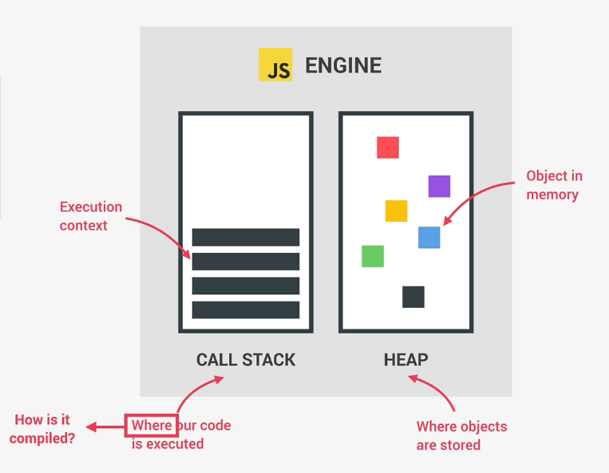
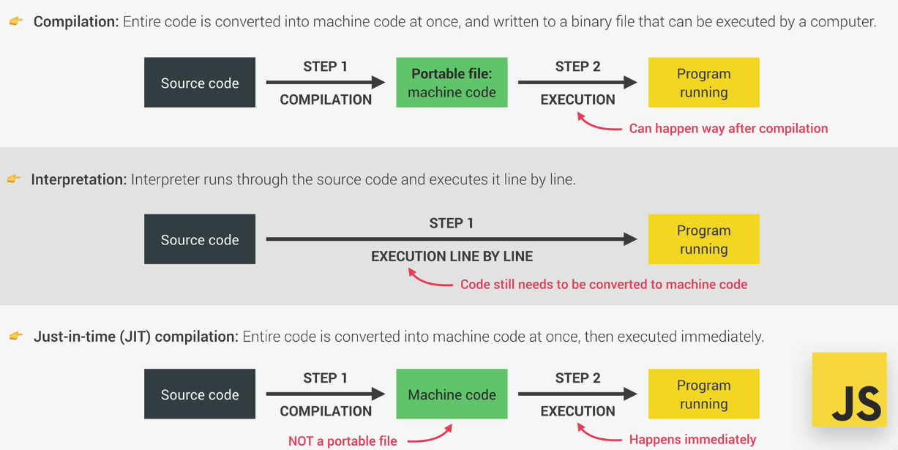
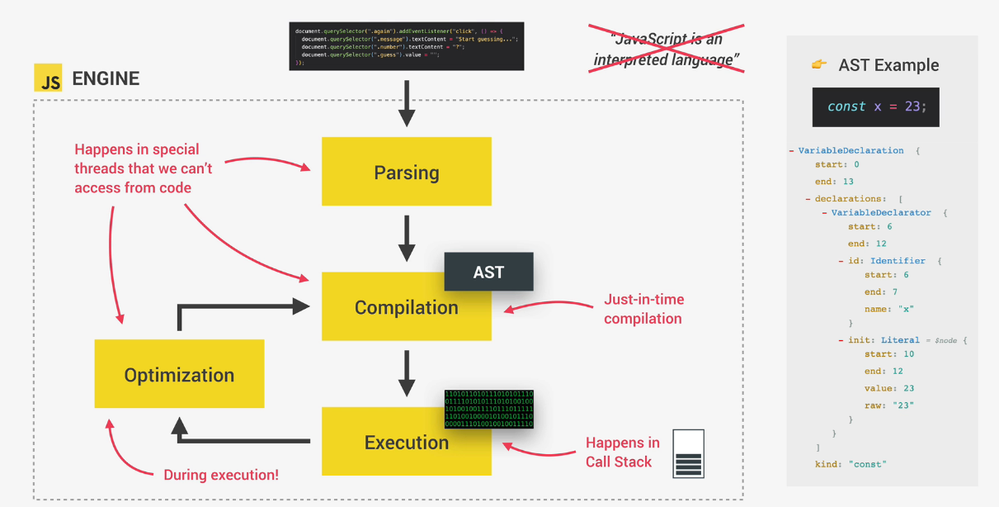
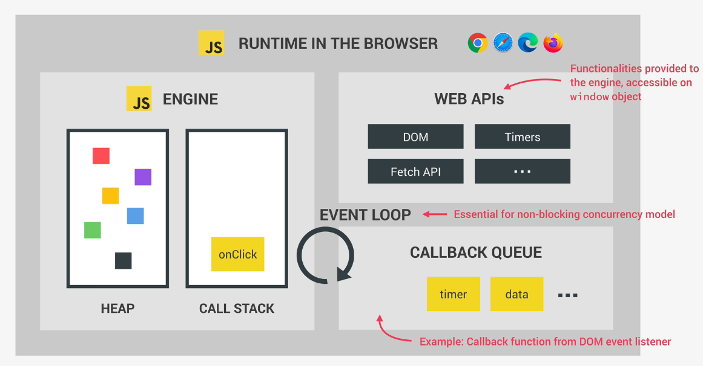

# JS ENGINE

### 1-Funcionamiento básico

El mas conocido es el V8 utilizado por google chrome y por NodeJS

Funcionamiento basico del engine:

### 2-Compilación

JS no es ni uin lenguaje interpretado ni una compilado. Es una mezcla entre los dos conocida como **Just-in-time compilation** en la cual todo el código se convierte en codigo maquina a la vez y luego se ejecuta de forma inmediata

Diferencias entre los distintos tipos de compilacion

Proceso de compilación en JS

### 3- Funcionamiento avanzado

